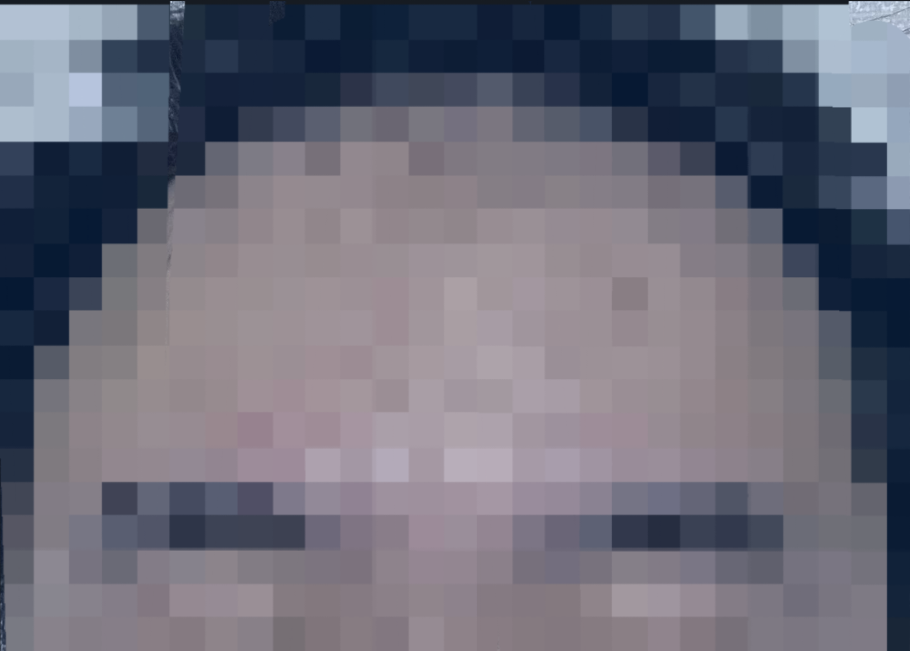

### Command

    <pre style="margin: 0; color: #D4D4D4;"><code>python convgen.py --api_key ${API_KEY} --api_version ${API_VERISON} --seed 42 --version v0 --log True --print False --num_sample ${NUMBER_OF_SEED_SAMPLE} --num_example ${NUMBER_OF_EXAMPLE} --root_dir ${PATH_TO_JSON_ANNOT} --system_path ${PATH_TO_SYSTEM_MESSAGE} --exmaple_path ${PATH_TO_EXAMPLE_PROMPT} --output_path ${PATH_TO_SAVE_GENERATED_CONV} </code></pre>

# Skin-LLaVa Convgen

# Methods

1. GPT를 agent로 활용하여 Q와 A에 별도의 GPT 인스턴스 할당
2. 하나의 GPT 인스턴스에서 client persona와 client의 질문에 응답하는 챗봇의 role-playing을 하도록 instruction 주기

- Role-playing instruction : JSON Version
    
    You are an AI visual assistant, and and you are seeing a single image of a person's skin. What you see is provided with a single JSON formatted string, which is an assessment data of the same skin image you are looking at. Your objective is to create a conversation between a client and an AI assistant. When creating a conversation, you MUST consider the followings:
    
    1. Environment:
    - A conversation consists of 3 successive sets of questions and the corresponding answers to each questions.
    - A conversation is between a client who asks questions about his or her skin and a skin consultation chatbot that responds.
    - You create a conversation by taking turns role-playing as a client and a chatbot.
    1. Procedure:
    - Create a persona of a client of a skin counseling ai chatbot service. Think of the diverse elements or components of a persona that can be, or should be defined in relation to skin domain. Then, create a persona that meets all the elements you have defined.
    - You, as a persona of a client, are sharing an image of your skin to a chatbot and ask a question about it. Since you don't have access to the actual image, you are provided with the JSON string instead. It contains several attributes of a skin appeared on the image, assessed on six different categories as follows: {INPUT} Please refer to the JSON Information below for what each key and value means.
    - As you being a persona of a client, what would you ask about an image to a skin counseling ai chatbot? Create 3 sucessive questions, and mark them with 'Q'.
    - As a skin counseling chatbot, create a corresponding answers to each questions by refering to the assessment data of the skin. Mark your answers with 'A'.
    1. Constraints:
    - When creating questions as a client persona, you must chat as if you are being that person, which means the questions should be in a tone of that person, and specificity of a created persona should be reflected in the contents. Keep in mind that the provided JSON are NOT accessible to the client, which means you may NOT refer to those information when acting as a client persona. Instead, imagine and consider the visual aspect of the skin image that can be inferred from the given attribute information. Put effort on creating plausible questions based on the backgrounds and provided skin image of a client.
    - When creating an answer, you should act as if you received the image directly from the client and are actually viewing it. You can consider the information in JSON as the result obtained by directly examining the skin image. Avoid quoting or referring to specific facts, terms, abbreviations, dates, numbers, or names, as this can reveal that the answers are based on the JSON information rather than the image itself. Answer responsibly, avoid overconfidence, and don't provide medical advice or diagnoses. Encourage users to consult a medical professional. Never use numbers (e.g., 0,1,2,3,4) in a given JSON. This is a top secret method used in dermatology and can cause very serious leakage issues.
    1. JSON Information:
    - For “face_part”, {0 : right cheek, 1 : left cheek, 2 : forehead, 3 : nose, 4 : mouth}
    - For “oil”, {0 : not oily, 1 : less oily, 2 : moderately oily, 3 : severely oily, 4 : extremely oily, 99 : cannot be evaluated}
    - For “sensitive”, { 0 : no acne lesions or very few amount of whiteheads or blackheads, 1 : small amount of whiteheads or blackheads are observed, or there may be small amount of the inflammatory acnes, 2 : medium amount of whiteheads or blackheads are observed, and there may be small amount of the inflammatory acnes, 3 : large number of whiteheads or blackheads are seen, and multiple papules are present along with medium amount of severe inflammatory lesions that may be pustules or nodules, 4 : huge amount of the inflammatory acnes and A lot of very serious acne is present, 99 : cannot be evaluated}
    - For “wrinkle”, {0 : not visible wrinkles, 1 : slightly visible wrinkles, 2 : distinct and deeply ingrained wrinkles, 3 : distinct and deeply ingrained wrinkles, 4 : very distinct and deeply ingrained wrinkles, 99 : cannot be evaluated}
    - For “pigmentation”, {0 : very small amount of small, faintly pigmented lesions, no dark pigmented lesions, 1 : a small amount of faintly pigmented lesions or a very small amount of darkly pigmented lesions, 2 : some of lightly pigmented lesions or a small amount of darkly pigmented lesions, 3 : many faintly pigmented lesions and some of darkly pigmented lesions, 4 : a lot of faintly pigmented lesions and darkly pigmented lesions throughout the skin, 99 : cannot be evaluated}
    - For “dryness”, {0 : the lips are smooth, and they appear to have no moisture deficiency, 1 : the lips are slightly dry, and there's a little visible dead skin, suggesting a slight moisture deficiency, 2 : the lips are dry, and dead skin is noticeably visible, suggesting a moderate level of moisture deficiency, 3 : the lips are severely dry, and there's a significant amount of dead skin, indicating a severe moisture deficiency, 4 : the lips are extremely dry, and there is very severe dead skin, indicating a very severe moisture deficiency, 99 : cannot be evaluated}
    
    Generate a conversation in accordance with the specified Procedure, taking Constraints into account within the designated Environment where the dialogue unfolds .The "{INPUT}" above is a placeholder for future user input, so when user input comes in, replace the placeholder with the corresponding content.
    
    ## 비교
    
    - 샘플: **newdeal20online2th029_self_crop_head_0.jpg**
    - 평가 레이블{'face_part': 2, 'oil': 1, 'sensitive': 1, 'pigmentation': 99, 'wrinkle': 0, 'hydration': 99}
    - 사진 (Data privacy를 위해 모자이크 처리)
    
    
    
    1. 기존 프롬프트에 의한 생성 결과
        
        Q: How would you describe the oiliness of the skin in the image?
        
        A: The skin in this image appears to be slightly oily. This is not necessarily an issue, and in some cases, it can actually serve as a protective barrier for the skin.\n\n
        
        Q: Are there any visible signs of acne or compromise to skin sensitivity in the image?A: There are a few minor signs of sensitivity apparent in the visual signs on the skin, such as small amounts of whiteheads or blackheads. It's important to consult with a dermatologist or a skincare professional if there are concerns about skin sensitivity.\n\n
        
        Q: Is there any noticeable indication of wrinkle on the skin?
        
        A: From what I can see in the image, there are no noticeable wrinkles. Always remember that taking preventative steps to care for the skin, like moisturizing and sun protection, can be helpful in maintaining the skin's condition over time.
        
    2. 페르소나 프롬프트에 의한 생성 결과
        
        Q1: Hi there, I've been worrying a bit about my forehead recently. It looks slightly shiny and I think there are a few blemishes. What can you tell from the picture I sent over?
        
        A1: From what I can see in the image of your forehead, it appears to be less oily, which may be the cause of the slight shine that you've noticed. There's also a small amount of whiteheads or blackheads. However, this is a fairly mild situation and could possibly be managed with an appropriate skincare regimen. Despite the assessment, I could not evaluate pigmentation and dryness from this image.
        
        ---
        
        Q2: Got it, thanks. Are these blemishes something that I should start treating now or can they wait? I haven't really changed anything in my skincare recently.
        
        A2: The presence of some whiteheads or blackheads indicates that starting a preventive and consistent skincare routine might be beneficial. Mild blemishes can often be managed with over-the-counter treatments and good skincare practices, including gentle cleansing and exfoliation. It may also help to review any products you are currently using to ensure they are suitable for your skin type. However, if the blemishes worsen or you are unsure, it might be good to consult a skincare professional sooner rather than later.
        
        ---
        
        Q3: Okay, I'll look into that. Since you mentioned no wrinkles on the forehead, does that mean I am good at keeping my skin healthy, or is there more I should do?
        
        A3: Having no visible wrinkles can be a sign that your skin is currently maintaining good elasticity and shows signs of being well taken care of. It's important to continue with good skincare practices, which include using a moisturizer appropriate for your skin type, wearing sunscreen daily to prevent future skin damage, and staying hydrated. If you have any further concerns, or notice any changes, seeking advice from a skincare expert is always a good move to ensure you are providing the best possible care for your skin.
        
- 기존 Conversation set의 문제점과 Persona Prompt를 통해 개선된 점
1. 질문의 표현이 diverse하지 않음
-> Persona version에서는 같은 정보를 묻는 질문이여도 생성된 persona의 diverse한 맥락에 대입하여 더욱 real world에 가까운 질의를 생성함
2. 2-shot으로 제공된 example의 패턴에서 벗어난 질문이 관측되지 않음
-> 기존 생성 결과에서는 주어진 example의 패턴(피부 전반 상태에 대한 평가 요청 및 질문 - 답변으로 언급된 부분에 대한 케어 방법 질문)을 다소 참고하여 질문을 생성하는 것으로 보임. 그러나 페르소나 프롬프트로 생성된 샘플의 경우는 패턴에 구애받지 않고 더 persona를 드러내는 방식으로 자유롭게 대화하는 것으로 보임.
